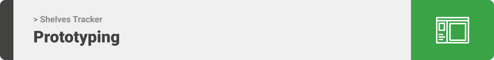
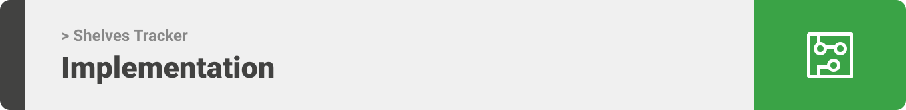

<div align="center">

> Shelves Tracker! A supermarket pressure sensor to detect the quantity of products left. 


**[PROJECT PHILOSOPHY](https://github.com/khaled-bissani/shelves-tracker#-project-philosophy) • [PROTOTYPING](https://github.com/khaled-bissani/shelves-tracker#-wireframes) • [TECH STACK](https://github.com/khaled-bissani/shelves-tracker#-tech-stack) • [IMPLEMENTATION](https://github.com/khaled-bissani/shelves-tracker#-impplementation) • [HOW TO RUN?](https://github.com/khaled-bissani/shelves-tracker#-how-to-run)**

</div>

<br><br>


> The Shelves Tracker app is an app that track all the items in the supermarket. Using a weight sensor, we can get the quantity of a specific product directly to the application that shows each item with the quantity.
>
> Aside of the quantity, The Shelves Tracker app keep tracking the expiry date for all the products in the supermarket and send a notification if the product will expire soon.

### User Stories
- As a user, I want to check all the products in the supermarket, so that I can see the quantity of each item
- As a user, I want to explore and search items, so that I can check a single item
- As a user, I want to have a chat interface, so that I can communicate with the supplier easily

<br><br>



> This design was planned before on paper, then moved to Figma app for the fine details.

| Website - Wireframes: |
| ----------------------|

| Landing-Signup  | Landing-Login|
| -----------------| ---|
|  | 

| Dashboard  | Client  |
| -----------------| -----|
|  |  |

| Expiry  | Profile  |
| -----------------| -----|
|  |  |

| Website - Mockups: |
| ----------------------|

| Landing-Signup  | Landing-Login|
| -----------------| -----|
|  |  |

| Dashboard  | Client  |
| -----------------| -----|
|  |  |

| Expiry  | Profile  |
| -----------------| -----|
|  |  |

| Application - Wireframes: |
| ----------------------|

| Landing  | Signup  | Login  | Home  |
| -----------------| -----|------|------|
|  |  |  |  |

| View-more  | Single-item  | Notification  | Add Category  |
| -----------------| -----|------|------|
|  |  |  |  |

| Add Product  | Profile  | Edit-profile  | Change-password  |
| -----------------| -----|------|------|
|  |  |  |  |

| Application - Mockups: |
| ----------------------|

| Landing  | Signup  | Login  | Home  |
| -----------------| -----|------|------|
|  |  |  |  |

| View-more  | Single-item  | Notification  | Add Category  |
| -----------------| -----|------|------|
|  |  |  |  |

| Add Product  | Profile  | Edit-profile  | Change-password  |
| -----------------| -----|------|------|
|  |  |  |  |

<br><br>


Here's a brief high-level overview of the tech stack the Shelves Tracker app uses:

- This project uses [Expo React Native](https://expo.dev/). Expo is a toolchain built around React Native to help you quickly start an app. It provides a set of tools that simplify the development and testing of React Native app and arms you with the components of users interface and services that are usually available in third-party native React Native components.
- For the website, this project uses [React](https://reactjs.org/) . React is a JavaScript library for building user interfaces.  React makes it painless to create interactive UIs. Design simple views for each state in your application, and React will efficiently update and render just the right components when your data changes. Declarative views make your code more predictable, simpler to understand, and easier to debug.
- For the server side, the app uses [NodeJs](https://nodejs.org/)  JavaScript runtime. NodeJS is used for server-side programming, and primarily deployed for non-blocking, event-driven servers, such as traditional web sites and back-end API services.
- For the NodeJs, the app uses [Express](https://expressjs.com/) framework. Express is a minimal and flexible Node.js web application framework that provides a robust set of features for web and mobile applications.
- For database, the app uses the [Mongo](https://www.mongodb.com/) database. MongoDB is a document database used to build highly available and scalable internet applications. With its flexible schema approach, it's popular with development teams using agile methodologies.
- For the Mongodb, the app uses the [Mongoose](https://mongoosejs.com/) library. Mongoose  is a JavaScript object-oriented programming library that creates a connection between MongoDB and the Node.js JavaScript runtime environment.
- For the hardware, the app uses the [Arduino](https://www.arduino.cc/). Arduino is an open-source electronics platform based on easy-to-use hardware and software.
- The component used in the hardware are: [ESP8266 Arduino](https://create.arduino.cc/projecthub/Niv_the_anonymous/esp8266-beginner-tutorial-project-6414c8) / Load Cell sensor (measure the weight) / [HX711](https://learn.sparkfun.com/tutorials/load-cell-amplifier-hx711-breakout-hookup-guide/all) load cell amplifier / Connecting wires / Breadboard.
- For the design, the app uses [Figma](https://www.figma.com/) application. Figma is a collaborative web application for interface design, with additional offline features enabled by desktop applications for macOS and Windows.

<br><br>


> Using the above mentioned tech stacks and the wireframes build with figma from the user sotries we have, the implementation of the app is shown as below, these are screenshots from the real app

| Website : |
| ----------------------|

| Landing-Signup  | Landing-Login|
| -----------------| ---|
|  | 

| Dashboard  | Client  |
| -----------------| -----|
|  |  |

| Expiry  | Profile  |
| -----------------| -----|
|  |  |

| Application : |
| ----------------------|

| Landing  | Signup  | Login  | Home  |
| -----------------| -----|------|------|
|  |  |  |  |

| View-more  | Single-item  | Notification  | Add Category  |
| -----------------| -----|------|------|
|  |  |  |  |

| Add Product  | Profile  | Edit-profile  | Change-password  |
| -----------------| -----|------|------|
|  |  |  |  |

| Signup Validation | Login Validation  | Add Category Validation | Add Product Validation |
| -----------------| -----|------|------|
|  |  |  |  |

| Wrong username or password | Category Confirmation  |  Product Confirmation |
| -----------------| -----|------|
|  |  |  |


| Hardware : |
| ----------------------|

| Board  | Load Cell  |
| -----------------| -----|
|  |  |

| Arduino Implementation  |
| ----------------------|
|   |


<br><br>


> This is an example of how you may give instructions on setting up your project locally.
To get a local copy up and running follow these simple example steps.

### Prerequisites

This is an example of how to list things you need to use the software and how to install them.
* npm
  ```sh
  npm install npm@latest -g
  ```

### Installation

1. Clone the repo
   ```sh
   git clone https://github.com/khaled-bissani/shelves-tracker.git
   ```

For the backend:

2. Navigate to the backend folder (nodejs) and run
   ```sh
   cd backend
   npm install
   npm start
   ```
3. In the backend folder create an .env file and include the following
    ```sh
    PORT = any port number

    IP_ADDRESS = your ip address

    DATABASE_URL = mongodb://localhost:port/databse-name

    JWT_SECRET_KEY = any string fot the jwt
    ```

For the frontend:

4. Navigate to the Supermarket frontend (react native) folder and run
   ```sh
   cd frontend
   cd supermarket-frontend
   npm install
   npm start
   ```
5. In the Supermarket frontend folder create an .env file and include the following
    ```sh
    BASE_URL = http://your-ip-address:PORT
    ```
6. Navigate to the Supplier frontend (react) folder and run
   ```sh
   cd frontend
   cd supplier-frontend
   npm install
   npm start
   ```
7. In the Supplier frontend folder create an .env file and include the following
    ```sh
    REACT_APP_BASE_URL = http://your-ip-address:PORT
    ```

In case of error while using npm
```sh
npm install --legacy-peer-deps
```