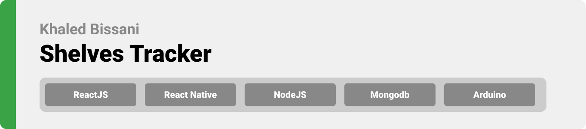

> Shelves Tracker! It is an IOT app that measures the quantity of products in the supermarket shelves using weight sensors and arduino. 


**[PROJECT PHILOSOPHY](https://github.com/khaled-bissani/shelves-tracker#-project-philosophy) • [PROTOTYPING](https://github.com/khaled-bissani/shelves-tracker#-wireframes) • [TECH STACK](https://github.com/khaled-bissani/shelves-tracker#-tech-stack) • [IMPLEMENTATION](https://github.com/khaled-bissani/shelves-tracker#-impplementation) • [HOW TO RUN?](https://github.com/khaled-bissani/shelves-tracker#-how-to-run)**

  

> The Shelves Tracker app is an app that track all the items in the supermarket. Using a weight sensor, we can get the quantity of a specific product directly to the application that shows each item with the quantity.
>
> Aside of the quantity, The Shelves Tracker app keep tracking the expiry date for all the products in the supermarket and send a notification if the product will expire soon.

### User Stories
- As a user, I want to check all the products in the supermarket, so that I can see the quantity of each item
- As a user, I want to explore and search items, so that I can check a single item
- As a user, I want to have a chat interface, so that I can communicate with the supplier easily

  

> This design was planned before on paper, then moved to Figma app for the fine details.

| Website - Wireframes: |
| ----------------------|

| Landing  | Dashboard  |
| -----------------| -----|
|  |  |

| Chat  | Client  |
| -----------------| -----|
|  |  |

| Expiry  | Profile  |
| -----------------| -----|
|  |  |

| Website - Mockups: |
| ----------------------|

| Landing  | Dashboard  |
| -----------------| -----|
|  |  |

| Chat  | Client  |
| -----------------| -----|
|  |  |

| Expiry  | Profile  |
| -----------------| -----|
|  |  |

| Application - Wireframes: |
| ----------------------|

| Landing  | Signup  | Login  | Home  |
| -----------------| -----|------|------|
|  | |  |  |

| View-more  | Single-item  | notification  | Chat  |
| -----------------| -----|------|------|
|  |  |  |  |

| Chat  | Profile  | Edit-profile  | Change-password  |
| -----------------| -----|------|------|
|  |  |  |  |

| Application - Mockups: |
| ----------------------|

| Landing  | Signup  | Login  | Home  |
| -----------------| -----|------|------|
|  |  |  |  |

| View-more  | Single-item  | notification  | Chat  |
| -----------------| -----|------|------|
|  |  |  |  |

| Chat  | Profile  | Edit-profile  | Change-password  |
| -----------------| -----|------|------|
|  |  |  |  |

  

Here's a brief high-level overview of the tech stack the Well app uses:

- This project uses [Expo React Native](https://expo.dev/). Expo is a toolchain built around React Native to help you quickly start an app. It provides a set of tools that simplify the development and testing of React Native app and arms you with the components of users interface and services that are usually available in third-party native React Native components.
- For the website, this project uses [React](https://reactjs.org/) . React is a JavaScript library for building user interfaces.  React makes it painless to create interactive UIs. Design simple views for each state in your application, and React will efficiently update and render just the right components when your data changes. Declarative views make your code more predictable, simpler to understand, and easier to debug.
- For the server side, the app uses [NodeJs](https://nodejs.org/)  JavaScript runtime. NodeJS is used for server-side programming, and primarily deployed for non-blocking, event-driven servers, such as traditional web sites and back-end API services.
- For the NodeJs, the app uses [Express](https://expressjs.com/) framework. Express is a minimal and flexible Node.js web application framework that provides a robust set of features for web and mobile applications.
- For database, the app uses the [Mongo](https://www.mongodb.com/) database . MongoDB is a document database used to build highly available and scalable internet applications. With its flexible schema approach, it's popular with development teams using agile methodologies.

  

> Uing the above mentioned tecch stacks and the wireframes build with figma from the user sotries we have, the implementation of the app is shown as below, these are screenshots from the real app

  

> This is an example of how you may give instructions on setting up your project locally.
To get a local copy up and running follow these simple example steps.

### Prerequisites

This is an example of how to list things you need to use the software and how to install them.